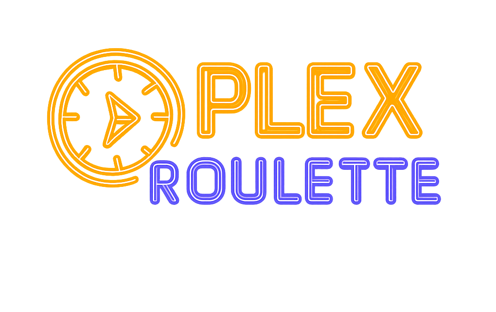
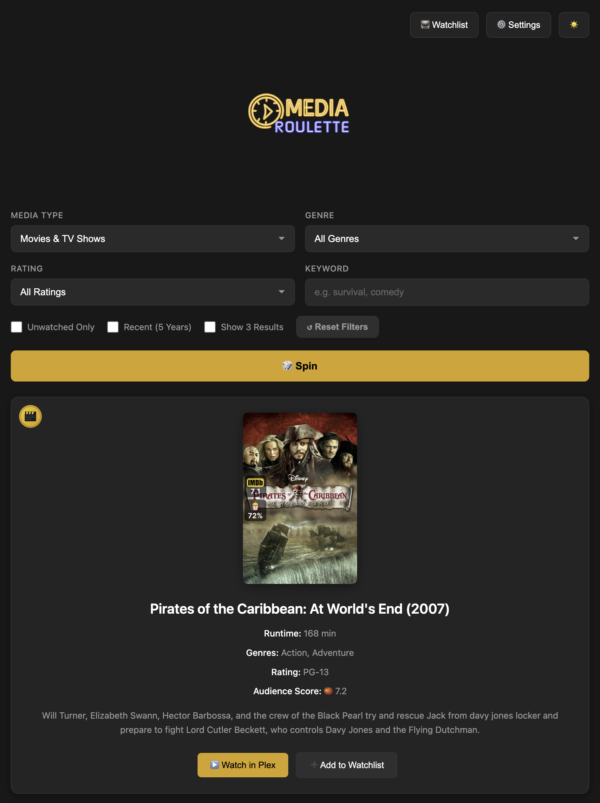
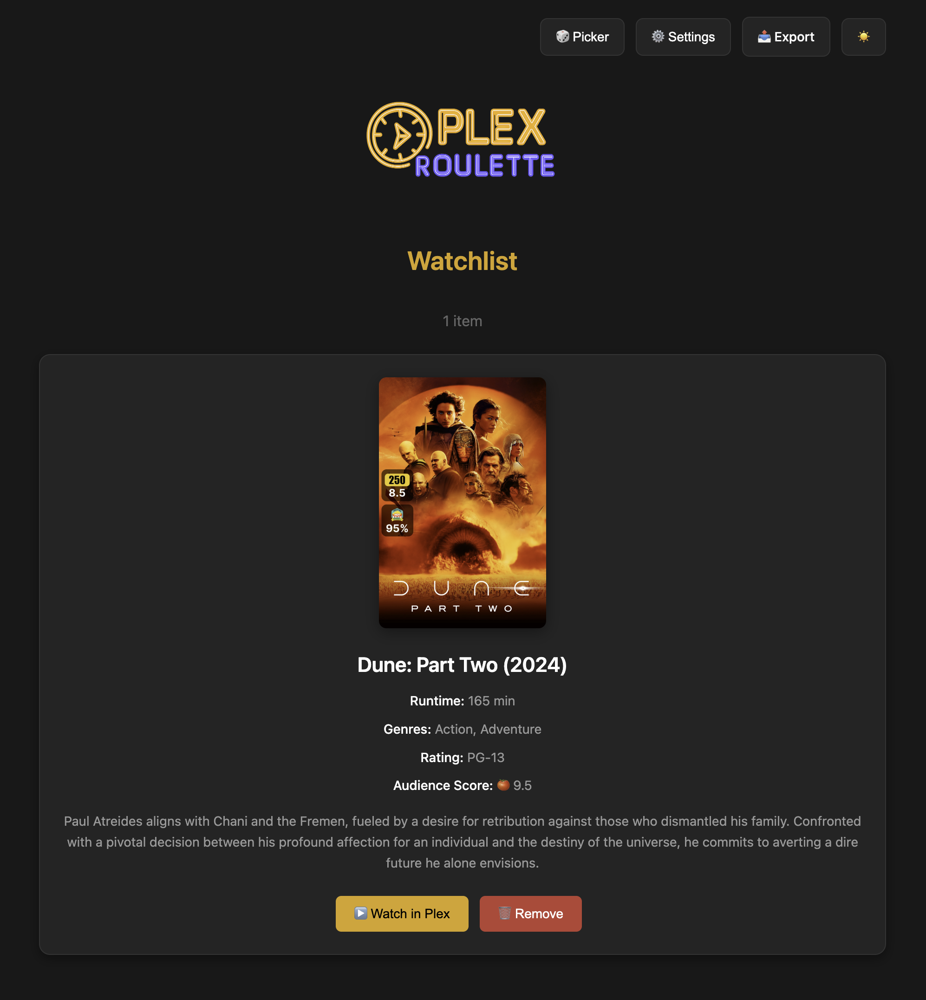
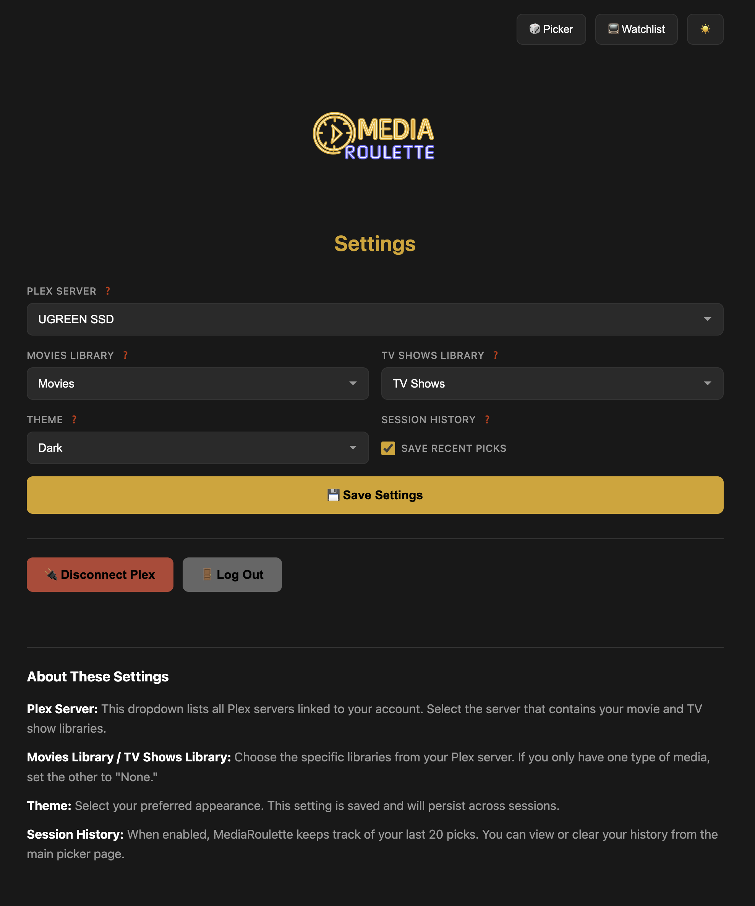

# MediaRoulette

<p align="center">
  
</p>

<p align="center">
  <strong>MediaRoulette for Plex — Can't decide what to watch? Let MediaRoulette pick for you!</strong>
</p>

<p align="center">
  <a href="https://discord.gg/hHvgWNnegq"></a>
  <a href="https://github.com/KelTech-Services/MediaRoulette/releases"></a>
</p>

<p align="center">
  A web app that randomly selects from your <strong>Movies, TV Shows, or both</strong> based on your preferences.<br>
  Great for large libraries where scrolling becomes overwhelming.
</p>

---

## Features

- 🎲 **Random Picker** — Randomly selects from your Movies, TV Shows, or both
- 🎯 **Smart Filters** — Filter by media type, genre, rating, keyword, and more
- 📺 **Watchlist** — Save picks for later viewing
- 🌙 **Dark/Light Themes** — Choose your preferred appearance
- 📤 **Export** — Download your watchlist as JSON or CSV
- 🔐 **Secure** — Authenticates directly with Plex using OAuth

---

## Screenshots

| Picker | Watchlist | Settings |
|--------|-----------|----------|
|  |  |  |

---

## Quick Start

### Docker Run (Recommended)

```bash
docker run -d \
  --name mediaroulette \
  -p 5000:5000 \
  -v mediaroulette-data:/app/data \
  -e SECRET_KEY=your-secret-key-here \
  --restart unless-stopped \
  ghcr.io/keltech-services/mediaroulette:latest
```

Then open **http://localhost:5000** in your browser.

### Docker Compose

Create a `docker-compose.yml` file:

```yaml
version: '3.8'

services:
  mediaroulette:
    image: ghcr.io/keltech-services/mediaroulette:latest
    container_name: mediaroulette
    ports:
      - "5000:5000"
    volumes:
      - mediaroulette-data:/app/data
    environment:
      - SECRET_KEY=your-secret-key-here
    restart: unless-stopped

volumes:
  mediaroulette-data:
```

Then run:

```bash
docker-compose up -d
```

---

## Configuration

### Environment Variables

| Variable | Description | Default |
|----------|-------------|---------|
| `SECRET_KEY` | Flask session encryption key (see below) | `mediaroulette-dev-key-change-in-prod` |
| `PORT` | Port to run the application | `5000` |

### Generating a Secret Key

The `SECRET_KEY` is used to securely sign session cookies. You should generate your own random key, especially if exposing the app outside your local network.

**Option 1:** Generate one online at [IT Tools Token Generator](https://it-tools.tech/token-generator?length=32)

**Option 2:** Generate via command line:
```bash
python3 -c "import secrets; print(secrets.token_hex(32))"
```

Then replace `your-secret-key-here` in the Docker command or compose file with your generated key.

### Data Storage

All user data is stored in the `/app/data` directory inside the container:

- `config.json` — Plex connection settings and preferences
- `watchlist.json` — Your saved watchlist items

Mount this directory as a volume to persist data between container restarts.

---

## How to Use

### 1. Sign In
Open MediaRoulette in your browser and click **Sign in with Plex**. You'll receive a code to enter at [plex.tv/link](https://plex.tv/link).

### 2. Configure Libraries
After signing in, go to **Settings** and select your Plex server and libraries (Movies and/or TV Shows).

### 3. Spin the Wheel
Return to the **Picker** page, set your filters (or leave them as defaults), and click **Spin** to get a random recommendation.

### 4. Save to Watchlist
Found something interesting? Click **Add to Watchlist** to save it for later. Access your saved items from the **Watchlist** page.

---

## Building from Source

### Prerequisites

- Python 3.9+
- pip

### Development Setup

```bash
# Clone the repository
git clone https://github.com/KelTech-Services/MediaRoulette.git
cd MediaRoulette

# Create a virtual environment (optional but recommended)
python3 -m venv venv
source venv/bin/activate

# Install dependencies
pip install -r requirements.txt

# Run the development server
python app.py
```

Open **http://localhost:5000** in your browser.

### Build Docker Image Locally

```bash
docker build -t mediaroulette .
docker run -d -p 5000:5000 -v mediaroulette-data:/app/data mediaroulette
```

---

## Troubleshooting

### Forgot Password / Locked Out

If you forgot your password or mistyped it during setup, you can reset your account:

**Option 1: Via Settings (if logged in)**

Go to **Settings** and click **Reset Password**. This will delete your account and redirect you to create a new one.

**Option 2: Manual Reset (if locked out)**

Delete the `users.json` file from your data directory and refresh the page:

```bash
# Docker volume
docker exec mediaroulette rm /app/data/users.json

# Or if using a bind mount (e.g., Portainer/Unraid)
rm /path/to/your/data/users.json
```

After deleting the file, reload MediaRoulette in your browser — you'll be prompted to create a new admin account.

> **Note:** This only resets your MediaRoulette login. Your Plex connection and settings are preserved in `config.json`.

---

## Tech Stack

- **Backend:** Python, Flask
- **Frontend:** HTML, CSS, Jinja2 Templates
- **Authentication:** Plex OAuth
- **Deployment:** Docker, Gunicorn

---

## License

MIT License — see [LICENSE](LICENSE) for details.

---

## Contributing

Contributions are welcome! Please open an issue or submit a pull request.

---

## Acknowledgments

- [Plex](https://plex.tv) for the amazing media server
- Built with ❤️ by [KelTech Services](https://github.com/KelTech-Services)
